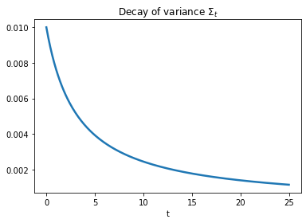
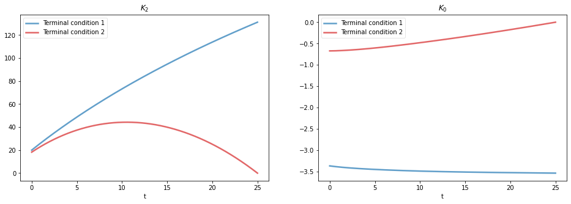
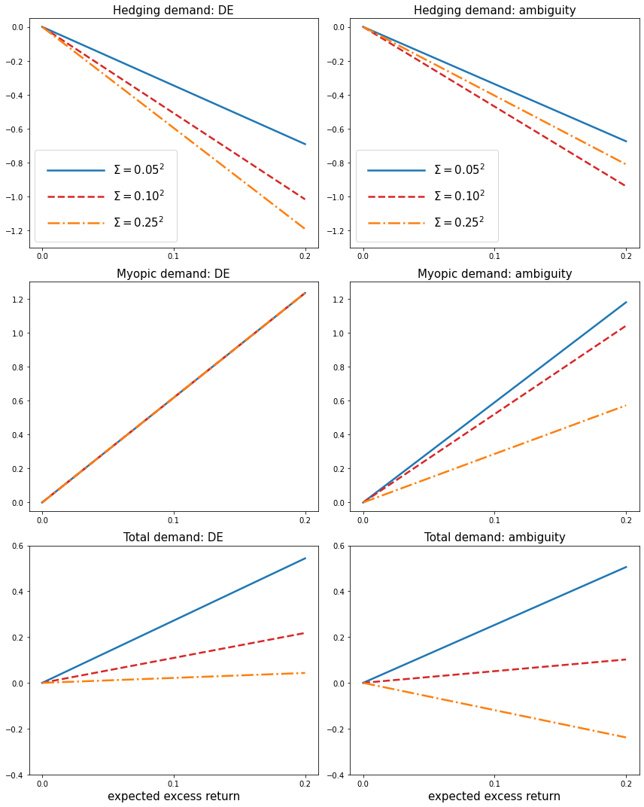
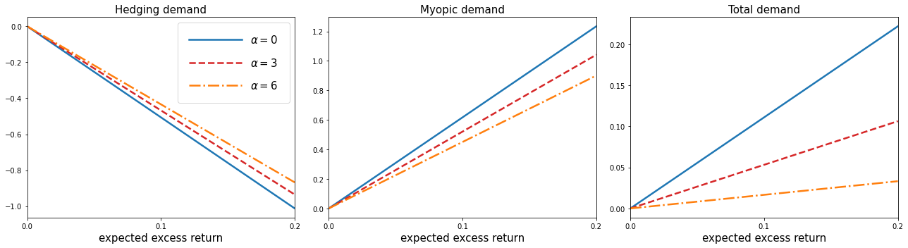

Appendix B Portfolio solution
=============================

This notebook illustrates the numerical computation for portofio choice
solution discussed in appendix B.

For the results in Section 5, we solved the HJB equation numerically.
While we posed the HJB equation in Section 5 using :math:`\Sigma_t` as a
state variable, our computations start from a single initialization.
Given the initial :math:`\Sigma_0`, :math:`\Sigma_t` is strictly
decreasing in t. Thus, for computational purposes, we express the value
function in terms :math:`t` instead of :math:`\Sigma_t`; and solve the
corresponding PDE. We derive this transformed PDE in the remainder of
this appendix.

We guess the value function as

.. math::

   K(x, z, t) = x + K_0(t) + \frac{1}{2} K_2(t) (z - r)^2

Coefficient of :math:`(z-r)^2` gives rise to the following differential
equation:

:raw-latex:`\begin{equation}
    0 = \frac{d K_2(t)}{ dt} + \frac{1}{\gamma |B_y|^2 + \alpha \Sigma_t} - \delta K_2(t) - 2 \frac{\frac{\Sigma_t}{|B_y|^2} ((\gamma-1)|B_y|^2 + \alpha \Sigma_t)}{\gamma |B_y|^2 + \alpha \Sigma_t} K_2(t) -  \frac{\frac{\Sigma_t^2}{|B_y|^2} ((\gamma-1)|B_y|^2 + \alpha \Sigma_t)}{\gamma |B_y|^2 + \alpha \Sigma_t} K_2(t)^2 \label{K2} \tag{1}
\end{equation}`

The remaining terms give rise to the following differential equation:

:raw-latex:`\begin{equation}
    0 = \frac{d K_0(t)}{ dt}  - \delta K_0(t) + \delta \log \delta - \delta + r + \frac{1}{2} K_2(t) \frac{\Sigma_t^2}{|B_y|^2} \label{K0} \tag{2}
\end{equation}`

We will use two terminal conditions to address the above ODEs.

-  **Terminal condition 1**: T = 100, 000, and :math:`K_2(T)`,
   :math:`K_0(T)` satisfy:

   .. math::  0 = \frac{1}{\gamma |B_y|^2} - \delta K_2(T)

   and

   .. math::  0 = \delta \log \delta - \delta + r - \delta K_0(T)

-  **Terminal condition 2**: T = 25 and and :math:`K_2(T)`,
   :math:`K_0(T)` satisfy:

   .. math::  K_2(T) = K_0 (T) = 0

To solve the ODEs :raw-latex:`\eqref{K2}` and :raw-latex:`\eqref{K0}`
numerically, we can use the following finite-difference method, by
discretizing the derivatives:

.. math::

   \begin{aligned}
   \frac{ {\color{red}{K_2(t)}} - {\color{red}{K_2(t -1)}} }{ dt} &= -\frac{1}{\gamma |B_y|^2 + \alpha \Sigma_t} + \delta {\color{red}{K_2(t)}} + 2 \frac{\frac{\Sigma_t}{|B_y|^2} ((\gamma-1)|B_y|^2 + \alpha \Sigma_t)}{\gamma |B_y|^2 + \alpha \Sigma_t} {\color{red}{K_2(t)}} +  \frac{\frac{\Sigma_t^2}{|B_y|^2} ((\gamma-1)|B_y|^2 + \alpha \Sigma_t)}{\gamma |B_y|^2 + \alpha \Sigma_t} {\color{red}{K_2(t)}}^2\\
   \frac{{\color{red}{K_0(t)}} - {\color{red}{K_0(t-1)}}}{ dt}  &= \delta {\color{red}{K_0(t)}} - \delta \log \delta + \delta - r - \frac{1}{2} K_2 \frac{\Sigma_t^2}{|B_y|^2}
   \end{aligned}

with

.. math::

   \Sigma_t = \frac{|B_y|^2 \Sigma_0}{t \Sigma_0 + |B_y|^2}

and we solve :math:`K_2(t)` and :math:`K_0(t)` iteratively, starting
from :math:`t=T` to :math:`t = 0`.

It’s also possible to use the ODE solver ``scipy.integrate.solve_ivp``.
Its documentation can be found
`here <https://docs.scipy.org/doc/scipy/reference/generated/scipy.integrate.solve_ivp.html>`__.
However, note that this solver is appropriate for initial value
problems, but our problem imposes terminal value conditions, so we need
to use the following **change of variable** to transform
:raw-latex:`\eqref{K2}` and :raw-latex:`\eqref{K0}` into initial value
problems in order to apply the solver:

Let :math:`\tilde{t} = T - t`, and write
:math:`\tilde{K}_2(\tilde{t}) = K_2(T-\tilde{t}) = K_2(t)`,
:math:`\tilde{K}_0(\tilde{t}) = K_0(T-\tilde{t}) = K_0(t)`. Then

.. math::

   \frac{dK_2(t)}{dt} = f(t, K_2(t)), t \in [0,T], K_2(T) \text{ given} \iff \frac{d\tilde{K}_2(\tilde{t})}{d\tilde{t}} = -f(T-\tilde{t}, \tilde{K}_2(\tilde{t})), \tilde{t} \in [0,T], \tilde{K}_2(0) \text{ given}

.. math::

   \frac{dK_0(t)}{dt} = f(t, K_0(t);K_2(t)), t \in [0,T], K_0(T) \text{ given} \iff \frac{d\tilde{K}_0(\tilde{t})}{d\tilde{t}} = -f(T-\tilde{t}, \tilde{K}_0(\tilde{t}); \tilde{K}_2(\tilde{t})), \tilde{t} \in [0,T], \tilde{K}_0(0) \text{ given}

:math:`\tilde{K}_2(\tilde{t})` and :math:`\tilde{K}_0(\tilde{t})` can be
directly solved using the solver. Then :math:`K_2(t)` and :math:`K_0(t)`
can be obtained by mapping :math:`\tilde{t}` to :math:`t`, which is just
flipping the order.

Parameters
----------

By default, the values of the parameters being used in our computation
are as follows:

================ =============
Parameters       Values
================ =============
:math:`\delta`   :math:`0.01`
:math:`\gamma`   :math:`5`
:math:`\alpha`   :math:`0`
:math:`B_y`      :math:`0.18`
:math:`r`        :math:`0.02`
:math:`\Sigma_0` :math:`0.1^2`
:math:`T`        25
================ =============

We would also experiment with alternative choices of
:math:`\alpha = 3,6` and :math:`\Sigma_0 = 0.05^2, 0.25^2`.

By default, we use **terminal condition 2** if not noted otherwise.

.. code:: ipython3

    import numpy as np
    from numba import njit
    import matplotlib as mpl
    import matplotlib.pyplot as plt
    import pandas as pd
    from scipy.integrate import solve_ivp
    mpl.rcParams["lines.linewidth"] = 2.5
    mpl.rcParams["legend.frameon"] = True
    mpl.rcParams["legend.framealpha"] = 0.5

.. code:: ipython3

    Σ0 = 0.1**2
    B_y = 0.18
    γ = 5
    α = 0
    δ = 0.01
    r = 0.02
    T = 25
    dt = 0.1

.. code:: ipython3

    time = np.arange(0, T+dt, dt)
    Σt = B_y**2 * Σ0 / (time * Σ0 + B_y**2)

.. code:: ipython3

    plt.plot(time, Σt)
    plt.title("Decay of variance $\Sigma_t$")
    plt.xlabel("t")
    plt.show()

.. code:: ipython3

    @njit
    def limiting_K2(args):
        Σ0, B_y, γ, α, δ, r = args
        return 1 / (δ * γ * B_y**2)
    
    @njit
    def limiting_K0(args):
        Σ0, B_y, γ, α, δ, r = args
        return np.log(δ) - 1 + r / δ

.. code:: ipython3

    @njit
    def simulate_Σ(T, dt, args):
        time = np.arange(0, T+dt, dt)
        Σ0, B_y, γ, α, δ, r = args
        Σt = B_y**2 * Σ0 / (time * Σ0 + B_y**2)
        return Σt
    
    @njit
    def simulate_K2(Σt, T, dt, args, limitingTerm=False):
        Σ0, B_y, γ, α, δ, r = args
        adjust = (γ - 1) * B_y**2 + α * Σt
        denominator =  γ * B_y**2 + α * Σt
        # K2
        K2 = np.zeros_like(Σt)
        T_max = len(K2) - 1
        if limitingTerm:
            K2[-1] = limiting_K2(args)
        for i in range(1, K2.shape[0]):
            K2[T_max - i] = K2[T_max-i+1]
            K2[T_max - i] += 1 / denominator[T_max-i+1] * dt
            K2[T_max - i] -= δ * K2[T_max-i+1] * dt
            K2[T_max - i] -= 2 * Σt[T_max-i+1] / B_y**2 * adjust[T_max-i+1] / denominator[T_max-i+1] * K2[T_max-i+1] * dt
            K2[T_max - i] -= Σt[T_max-i+1] **2 / B_y**2 * adjust[T_max-i+1] / denominator[T_max-i+1] * K2[T_max-i+1]**2 * dt
        
        return K2
    
    
    @njit
    def simulate_K0(T, dt, args, limitingTerm=False):
        Σ0, B_y, γ, α, δ, r = args
        Σt = simulate_Σ(T, dt, args)
        K2 = simulate_K2(Σt, T, dt, args, limitingTerm)
        adjust = (γ - 1) * B_y**2 + α * Σt
        denominator =  γ * B_y**2 + α * Σt
        T_max = Σt.shape[0] - 1
        # K1
        K0 = np.zeros_like(Σt)
        if limitingTerm:
            K0[-1] = limiting_K0(args)
        for i in range(1, K0.shape[0]):
            K0[T_max - i] = K0[T_max - i + 1] - δ * K0[T_max - i + 1] * dt
            K0[T_max - i] += (δ * np.log(δ) - δ + r) * dt
            K0[T_max - i] += 1/2 * K2[T_max-i+1] * Σt[T_max - i + 1]**2 / B_y**2 * dt
            
        return K2, K0

.. code:: ipython3

    Σt = simulate_Σ(T, dt, args=(Σ0, B_y, γ, α, δ, r))
    K2, K0 = simulate_K0(T, dt, args=(Σ0, B_y, γ, α, δ, r))
    K24, K04 = simulate_K0(T, dt, args=(Σ0, B_y, γ, 3., δ, r))
    K28, K08 = simulate_K0(T, dt, args=(Σ0, B_y, γ, 6., δ, r))
    K2h, K0h = simulate_K0(T, dt, args=(0.25**2, B_y, γ, α, δ, r))
    K24h, K04h = simulate_K0(T, dt, args=(0.25**2, B_y, γ, 3., δ, r))
    K28h, K08h = simulate_K0(T, dt, args=(0.25**2, B_y, γ, 6., δ, r))
    K2l, K0l = simulate_K0(T, dt, args=(0.05**2, B_y, γ, α, δ, r))
    K24l, K04l = simulate_K0(T, dt, args=(0.05**2, B_y, γ, 3., δ, r))
    K28l, K08l = simulate_K0(T, dt, args=(0.05**2, B_y, γ, 6., δ, r))
    
    K2_limiting, K0_limiting = simulate_K0(100_000, dt, args=(Σ0, B_y, γ, α, δ, r), limitingTerm=True)

.. code:: ipython3

    # using ODE solver, for comparison
    
    def f_K̃2(t̃, K̃2, *args):
        Σ0, B_y, γ, α, δ, r, T = args
        Σ = B_y**2 * Σ0 / ((T-t̃) * Σ0 + B_y**2)
        RHS = -(-1/(γ*B_y**2 + α*Σ) + δ*K̃2 + \
                           2*K̃2*(Σ/B_y**2 * ((γ-1)*B_y**2 + α*Σ))/(γ*B_y**2 + α*Σ) + \
                           K̃2**2*Σ**2/B_y**2 *  ((γ-1)*B_y**2 + α*Σ)/(γ*B_y**2 + α*Σ))
        return RHS
    
    def f_K̃0(t̃, K̃0, *args):
        Σ0, B_y, γ, α, δ, r, T, K̃2_sol = args
    
        Σ = B_y**2 * Σ0 / ((T-t̃) * Σ0 + B_y**2)
    
        RHS = -δ*K̃0 + δ*np.log(δ) - δ + r + 0.5* K̃2_sol.sol(t̃) * Σ**2/B_y**2
    
        return RHS
    
    args_K̃2 = Σ0, B_y, γ, α, δ, r, T
    K̃2_sol = solve_ivp(f_K̃2, [0, time[-1]], [0], args = args_K̃2, t_eval =time, dense_output=True)
    args_K̃0 = Σ0, B_y, γ, α, δ, r, T, K̃2_sol
    K̃0_sol = solve_ivp(f_K̃0, [0, time[-1]], [0], args = args_K̃0, t_eval =time, dense_output=True)
    
    args = Σ0, B_y, γ, α, δ, r
    time_lim = np.arange(0, 100000+dt, dt)
    
    args_K̃2_lim = Σ0, B_y, γ, α, δ, r, 100000
    K̃2_sol_lim = solve_ivp(f_K̃2, [0, time_lim[-1]], [limiting_K2(args)], args = args_K̃2_lim, t_eval =time_lim, dense_output=True)
    args_K̃0_lim = Σ0, B_y, γ, α, δ, r, 100000, K̃2_sol_lim
    K̃0_sol_lim = solve_ivp(f_K̃0, [0, time_lim[-1]], [limiting_K0(args)], args = args_K̃0_lim, t_eval =time_lim, dense_output=True)

We illustrate the solutions of :math:`K_2` and :math:`K_0` (with default
parameters, both terminal conditions) in the following plot. We also
compare the solution given by finite-difference and by the Scipy ODE
solver.

.. code:: ipython3

    fig, (ax1, ax2) = plt.subplots(1,2, figsize=(16,5))
    ax1.plot(time, K2_limiting[:len(time)], label="TC 1, finite-difference")
    ax1.plot(time, K̃2_sol_lim.y.flatten()[::-1][:len(time)], label="TC 1, solver", linestyle = 'dashed')
    ax1.plot(time, K2, label="TC 2, finite-difference")
    ax1.plot(time, K̃2_sol.y.flatten()[::-1], label="TC 2, solver", linestyle = 'dashed')
    ax1.set_xlabel("t")
    ax1.legend()
    ax1.set_title("$K_2$")
    
    ax2.plot(time, K0_limiting[:len(time)], label="TC 1, finite-difference")
    ax2.plot(time, K̃0_sol_lim.y.flatten()[::-1][:len(time)], label="TC 1, solver", linestyle = 'dashed')
    ax2.plot(time, K0, label="TC 2, finite-difference")
    ax2.plot(time, K̃0_sol.y.flatten()[::-1], label="TC 2, solver", linestyle = 'dashed')
    ax2.set_xlabel("t")
    ax2.legend()
    ax2.set_title("$K_0$")
    plt.show()

Portfolio choice and expected excess return
-------------------------------------------

We decompose the optimal portofolio choice :math:`\psi^*` into myopic
demand and hedging demand:

.. math::

    \psi^* = \underbrace{\frac{z-r}{\gamma |B_y|^2 + \alpha \Sigma_t}}_\text{myopic}\quad \underbrace{-  K_2 (z -r) \frac{\Sigma_t}{|B_y|^2} \left(\frac{(\gamma-1) |B_y|^2 + \alpha \Sigma_t}{\gamma |B_y|^2 + \alpha \Sigma_t}  \right)}_\text{hedging}

We illustrate hedging demand, myopic demand and total demand in terms of
expected excess return, :math:`z - r`, at time :math:`t = 0`.

.. code:: ipython3

    γ = 5
    T = 25
    αs = [0,  3 , 6]
    Σt = simulate_Σ(T, 0.1, args=(Σ0, B_y, γ, αs[0], δ, r))
    excess_return = np.linspace(0, 0.2)
    
    
    def myopic(excess_r, args):
        Σ0, B_y, γ, α, δ, r = args
        return excess_r / (γ * B_y**2 + α * Σ0)
    
    def hegding(excess_r, k2, args):
        Σ0, B_y, γ, α, δ, r = args
        adjust = (γ - 1) * B_y**2 + α * Σ0
        temp = - k2 * excess_r * Σ0 / B_y**2 * adjust
        temp /= γ * B_y**2 + α * Σ0
        return temp
    
    myopic0 = myopic(excess_return, args=(Σt[0], B_y, γ, αs[0], δ, r))
    myopic1 = myopic(excess_return, args=(Σt[0], B_y, γ, αs[1], δ, r))
    myopic2 = myopic(excess_return, args=(Σt[0], B_y, γ, αs[2], δ, r))
    
    hedging0 = hegding(excess_return, K2[0], args=(Σt[0], B_y, γ, αs[0], δ, r))
    hedging1 = hegding(excess_return, K24[0], args=(Σt[0], B_y, γ, αs[1], δ, r))
    hedging2 = hegding(excess_return, K28[0], args=(Σt[0], B_y, γ, αs[2], δ, r))
    
    fig,(ax1, ax2, ax3) = plt.subplots(1,3, figsize=(18,5))
    
    ax1.plot(excess_return,  hedging0, label="$\\alpha = 0$")
    ax1.plot(excess_return,  hedging1, label="$\\alpha = 3$", color="C3", linestyle="--")
    ax1.plot(excess_return,  hedging2, label="$\\alpha = 6$", color="C1", linestyle="-.")
    ax1.set_title("Hedging demand", fontsize=15)
    
    ax2.plot(excess_return, myopic0, label="$\\alpha = 0$")
    ax2.plot(excess_return, myopic1, label="$\\alpha = 3$", color="C3", linestyle="--")
    ax2.plot(excess_return, myopic2, label="$\\alpha = 6$", color="C1", linestyle="-.")
    ax2.set_title("Myopic demand", fontsize=15)
    
    ax3.plot(excess_return, myopic0 +  hedging0, label="$\\alpha = 0$")
    ax3.plot(excess_return, myopic1 +  hedging1, label="$\\alpha = 3$", color="C3", linestyle="--")
    ax3.plot(excess_return, myopic2 +  hedging2, label="$\\alpha = 6$", color="C1", linestyle="-.")
    ax3.set_title("Total demand", fontsize=15)
    
    for ax in [ax1, ax2, ax3]:
        ax.set_xticks([0.0, 0.1, 0.2])
        ax.set_xlim(0.0, 0.2)
        ax.set_xlabel("expected excess return", fontsize=15)
    ax1.legend(fontsize=15, framealpha=0.8,  handlelength=5, borderpad=1.1, labelspacing=1.1)
        
        
    plt.tight_layout()
    plt.show()

.. code:: ipython3

    fig, axes = plt.subplots(3,2, figsize=(12, 15))
    
    # γ = 5
    # DE
    ## hedging
    α = αs[0]
    axes[0,0].plot(excess_return, hegding(excess_return, K2l[0], args=(0.05**2, B_y, γ, α, δ, r)), color="C0")
    axes[0,0].plot(excess_return, hegding(excess_return, K2[0], args=(Σt[0], B_y, γ, α, δ, r)), color="C3", linestyle="--")
    axes[0,0].plot(excess_return, hegding(excess_return, K2h[0], args=(0.25**2, B_y, γ, α, δ, r)), color="C1", linestyle="-.")
    axes[0,0].set_title("Hedging demand: DE", fontsize=15)
    ## myopic
    axes[1,0].plot(excess_return, myopic(excess_return, args=(0.05**2, B_y, γ, α, δ, r)))
    axes[1,0].plot(excess_return, myopic(excess_return, args=(Σt[0], B_y, γ, α, δ, r)), color="C3", linestyle="--")
    axes[1,0].plot(excess_return, myopic(excess_return, args=(0.25**2, B_y, γ, α, δ, r)), color="C1", linestyle="-.")
    axes[1,0].set_title("Myopic demand: DE", fontsize=15)
    ## total
    axes[2,0].plot(excess_return, myopic(excess_return, args=(0.05**2, B_y, γ, α, δ, r))
                   + hegding(excess_return, K2l[0], args=(0.05**2, B_y, γ, α, δ, r)))
    axes[2,0].plot(excess_return, myopic(excess_return, args=(Σt[0], B_y, γ, α, δ, r))
                   + hegding(excess_return, K2[0], args=(Σt[0], B_y, γ, α, δ, r)), color="C3", linestyle="--")
    axes[2,0].plot(excess_return, myopic(excess_return, args=(0.25**2, B_y, γ, α, δ, r))
                   + hegding(excess_return, K2h[0], args=(0.25**2, B_y, γ, α, δ, r)), color="C1", linestyle="-.")
    axes[2,0].set_title("Total demand: DE", fontsize=15)
    
    # ambiguity
    α = αs[1]
    ## hedging
    axes[0,1].plot(excess_return, hegding(excess_return, K24l[0], args=(0.05**2, B_y, γ, α, δ, r)))
    axes[0,1].plot(excess_return, hegding(excess_return, K24[0], args=(Σt[0], B_y, γ, α, δ, r)), color="C3", linestyle="--")
    axes[0,1].plot(excess_return, hegding(excess_return, K24h[0], args=(0.25**2, B_y, γ, α, δ, r)), color="C1", linestyle="-.")
    axes[0,1].set_title("Hedging demand: ambiguity", fontsize=15)
    ## myopic
    axes[1,1].plot(excess_return, myopic(excess_return, args=(0.05**2, B_y, γ, α, δ, r)))
    axes[1,1].plot(excess_return, myopic(excess_return, args=(Σt[0], B_y, γ, α, δ, r)), color="C3", linestyle="--")
    axes[1,1].plot(excess_return, myopic(excess_return, args=(0.25**2, B_y, γ, α, δ, r)), color="C1", linestyle="-.")
    axes[1,1].set_title("Myopic demand: ambiguity", fontsize=15)
    ## total
    axes[2,1].plot(excess_return, myopic(excess_return, args=(0.05**2, B_y, γ, α, δ, r))
                   + hegding(excess_return, K24l[0], args=(0.05**2, B_y, γ, α, δ, r)))
    axes[2,1].plot(excess_return, myopic(excess_return, args=(Σt[0], B_y, γ, α, δ, r))
                   + hegding(excess_return, K24[0], args=(Σt[0], B_y, γ, α, δ, r)), color="C3", linestyle="--")
    axes[2,1].plot(excess_return, myopic(excess_return, args=(0.25**2, B_y, γ, α, δ, r))
                   + hegding(excess_return, K24h[0], args=(0.25**2, B_y, γ, α, δ, r)), color="C1", linestyle="-.")
    axes[2,1].set_title("Total demand: ambiguity", fontsize=15)
    
    
    for i in range(axes.shape[0]):
        for j in range(axes.shape[1]):
            axes[i,j].set_xticks([0,0.1,0.2])
    axes[0,0].legend(["$\\Sigma=0.05^2$", "$\\Sigma=0.10^2$","$\\Sigma=0.25^2$",], fontsize=15, framealpha=0.8,  handlelength=5, borderpad=1.1, labelspacing=1.1)
    axes[0,1].legend(["$\\Sigma=0.05^2$", "$\\Sigma=0.10^2$","$\\Sigma=0.25^2$",], fontsize=15, framealpha=0.8,  handlelength=5, borderpad=1.1, labelspacing=1.1)
    axes[2,0].set_xlabel("expected excess return", fontsize=15)
    axes[2,1].set_xlabel("expected excess return", fontsize=15)
    
    axes[0,0].set_ylim(-1.3, 0.05)
    axes[0,1].set_ylim(-1.3, 0.05)
    
    axes[1,0].set_ylim(-0.05, 1.3)
    axes[1,1].set_ylim(-0.05, 1.3)
    
    axes[2,0].set_ylim(-0.4, 0.6)
    axes[2,1].set_ylim(-0.4, 0.6)
    plt.tight_layout()

As demands are proportional to :math:`z-r`, we report in Table 1 and
Table 2 the slope of demand with different choices of parameters and
terminal conditions.

The slope of hedging demand is given by:

.. math::

   K_2 \frac{\frac{\Sigma}{B_y^2}[(\gamma - 1) + \alpha \frac{\Sigma}{B_y^2}]}{\gamma + \alpha \frac{\Sigma}{B_y^2}}

The slope of myopic demand is given by:

.. math::

   \frac{1}{\gamma |B_y|^2 + \alpha \Sigma_t}

The slope of total demand is just the sum of the two slopes above.

Tables 1 and 2 give the slopes of the portfolio rules depicted in
Figures 1 and 2, respectively, in comparison to the slopes implied by
the infinite-horizon problem. The total demand slopes are lower for the
infinite-horizon problem with the :math:`\alpha=6` slope actually
negative. See Table 1.

The hedging demand remains non-monotone under ambiguity aversion as we
vary :math:`Σ_0` for the infinite-horizon problem. See Table 2(b) for
:math:`\alpha=3`.

.. code:: ipython3

    def myopic_slope(args):
        Σ0, B_y, γ, α, δ, r = args
        return 1 / (γ * B_y**2 + α * Σ0)
    
    def hedging_slope(k2, args):
        Σ0, B_y, γ, α, δ, r = args
        adjust = (γ - 1) * B_y**2 + α * Σ0
        temp = - k2 * Σ0 / B_y**2 * adjust
        temp /= γ * B_y**2 + α * Σ0
        return temp
    
    def total_slope(k2, args):
        Σ0, B_y, γ, α, δ, r = args
        my_sl = myopic_slope(args)
        hed_sl = hedging_slope(k2, args)
        return my_sl + hed_sl

.. code:: ipython3

    # table 1
    γ = 5
    Σ = 0.1**2
    Alphas = [0, 3, 6]
    
    temp = []
    for alpha in Alphas:
        hed_temp = []
        k2_Miao, _ = simulate_K0(25, 0.1, args=(Σ, B_y, γ, alpha, δ, r), limitingTerm=False)
        hed_Miao = hedging_slope(k2_Miao[0], args=(Σ, B_y, γ, alpha, δ, r))
        k2_Hansen, _ = simulate_K0(100_000, 0.1, args=(Σ, B_y, γ, alpha, δ, r), limitingTerm=True)
        hed_Hansen = hedging_slope(k2_Hansen[0], args=(Σ, B_y, γ, alpha, δ, r))
        hed_temp.append(hed_Hansen)
        hed_temp.append(hed_Miao)
        temp.append(hed_temp)
        
    for alpha in Alphas:
        my_temp = []
        k2_Miao, _ = simulate_K0(25, 0.1, args=(Σ, B_y, γ, alpha, δ, r), limitingTerm=False)
        my_Miao = myopic_slope(args=(Σ, B_y, γ, alpha, δ, r))
        k2_Hansen, _ = simulate_K0(100_000, 0.1, args=(Σ, B_y, γ, alpha, δ, r), limitingTerm=True)
        my_Hansen = myopic_slope(args=(Σ, B_y, γ, alpha, δ, r))
        my_temp.append(my_Hansen)
        my_temp.append(my_Miao)
        temp.append(my_temp)
        
    for alpha in Alphas:
        total_temp = []
        k2_Miao, _ = simulate_K0(25, 0.1, args=(Σ, B_y, γ, alpha, δ, r), limitingTerm=False)
        total_Miao = total_slope(k2_Miao[0], args=(Σ, B_y, γ, alpha, δ, r))
        k2_Hansen, _ = simulate_K0(100_000, 0.1, args=(Σ, B_y, γ, alpha, δ, r), limitingTerm=True)
        total_Hansen = total_slope(k2_Hansen[0], args=(Σ, B_y, γ, alpha, δ, r))
        total_temp.append(total_Hansen)
        total_temp.append(total_Miao)
        temp.append(total_temp)
    
    data1 = np.round(temp,3)
    contents = ["Hedging demand", "Myopic demand", "Total demand"]
    ids = pd.MultiIndex.from_product([contents, ['\(\\alpha = 0\)', '\(\\alpha = 3\)', "\(\\alpha = 6\)"]])
    tab1 = pd.DataFrame(data1, index=ids, columns=["\(\textbf{TC 1}\)", "\(\textbf{TC 2}\)"])
    print("Table 1: γ = 5, and Σ_0 = 0.1^2")
    tab1

.. parsed-literal::

    Table 1: γ = 5, and Σ_0 = 0.1^2

.. raw:: html

    

    
    <table border="1" class="dataframe">
      <thead>
        <tr style="text-align: right;">
          <th></th>
          <th></th>
          <th>\(\textbf{TC 1}\)</th>
          <th>\(\textbf{TC 2}\)</th>
        </tr>
      </thead>
      <tbody>
        <tr>
          <th rowspan="3" valign="top">Hedging demand</th>
          <th>\(\alpha = 0\)</th>
          <td>-5.529</td>
          <td>-5.084</td>
        </tr>
        <tr>
          <th>\(\alpha = 3\)</th>
          <td>-5.136</td>
          <td>-4.698</td>
        </tr>
        <tr>
          <th>\(\alpha = 6\)</th>
          <td>-4.789</td>
          <td>-4.359</td>
        </tr>
        <tr>
          <th rowspan="3" valign="top">Myopic demand</th>
          <th>\(\alpha = 0\)</th>
          <td>6.173</td>
          <td>6.173</td>
        </tr>
        <tr>
          <th>\(\alpha = 3\)</th>
          <td>5.208</td>
          <td>5.208</td>
        </tr>
        <tr>
          <th>\(\alpha = 6\)</th>
          <td>4.505</td>
          <td>4.505</td>
        </tr>
        <tr>
          <th rowspan="3" valign="top">Total demand</th>
          <th>\(\alpha = 0\)</th>
          <td>0.644</td>
          <td>1.089</td>
        </tr>
        <tr>
          <th>\(\alpha = 3\)</th>
          <td>0.073</td>
          <td>0.511</td>
        </tr>
        <tr>
          <th>\(\alpha = 6\)</th>
          <td>-0.284</td>
          <td>0.145</td>
        </tr>
      </tbody>
    </table>
    

.. code:: ipython3

    # table 2(a)
    γ = 5
    alpha = 0
    
    temp = []
    for Σ in [0.05**2, 0.10**2, 0.25**2]:
        hed_temp = []
        k2_Miao, _ = simulate_K0(25, 0.1, args=(Σ, B_y, γ, alpha, δ, r), limitingTerm=False)
        hed_Miao = hedging_slope(k2_Miao[0], args=(Σ, B_y, γ, alpha, δ, r))
        k2_Hansen, _ = simulate_K0(100_000, 0.1, args=(Σ, B_y, γ, alpha, δ, r), limitingTerm=True)
        hed_Hansen = hedging_slope(k2_Hansen[0], args=(Σ, B_y, γ, alpha, δ, r))
        hed_temp.append(hed_Hansen)
        hed_temp.append(hed_Miao)
        temp.append(hed_temp)
        
    for Σ in [0.05**2, 0.10**2, 0.25**2]:
        my_temp = []
        k2_Miao, _ = simulate_K0(25, 0.1, args=(Σ, B_y, γ, alpha, δ, r), limitingTerm=False)
        my_Miao = myopic_slope(args=(Σ, B_y, γ, alpha, δ, r))
        k2_Hansen, _ = simulate_K0(100_000, 0.1, args=(Σ, B_y, γ, alpha, δ, r), limitingTerm=True)
        my_Hansen = myopic_slope(args=(Σ, B_y, γ, alpha, δ, r))
        my_temp.append(my_Hansen)
        my_temp.append(my_Miao)
        temp.append(my_temp)
        
    for Σ in [0.05**2, 0.10**2, 0.25**2]:
        total_temp = []
        k2_Miao, _ = simulate_K0(25, 0.1, args=(Σ, B_y, γ, alpha, δ, r), limitingTerm=False)
        total_Miao = total_slope(k2_Miao[0], args=(Σ, B_y, γ, alpha, δ, r))
        k2_Hansen, _ = simulate_K0(100_000, 0.1, args=(Σ, B_y, γ, alpha, δ, r), limitingTerm=True)
        total_Hansen = total_slope(k2_Hansen[0], args=(Σ, B_y, γ, alpha, δ, r))
        total_temp.append(total_Hansen)
        total_temp.append(total_Miao)
        temp.append(total_temp)
    
    data2a = np.round(temp,3)
    contents = ["Hedging demand", "Myopic demand", "Total demand"]
    ids = pd.MultiIndex.from_product([contents, ['\(Σ_0 = 0.05^2\)', '\(Σ_0 = 0.10^2\)', "\(Σ_0 = 0.25^2\)"]])
    tab2a = pd.DataFrame(data2a, index=ids, columns=["\(\textbf{TC 1}\)", "\(\textbf{TC 2}\)"])
    print("Table 2(a): DE(α=0)")
    tab2a

.. parsed-literal::

    Table 2(a): DE(α=0)

.. raw:: html

    

    
    <table border="1" class="dataframe">
      <thead>
        <tr style="text-align: right;">
          <th></th>
          <th></th>
          <th>\(\textbf{TC 1}\)</th>
          <th>\(\textbf{TC 2}\)</th>
        </tr>
      </thead>
      <tbody>
        <tr>
          <th rowspan="3" valign="top">Hedging demand</th>
          <th>\(Σ_0 = 0.05^2\)</th>
          <td>-4.585</td>
          <td>-3.455</td>
        </tr>
        <tr>
          <th>\(Σ_0 = 0.10^2\)</th>
          <td>-5.529</td>
          <td>-5.084</td>
        </tr>
        <tr>
          <th>\(Σ_0 = 0.25^2\)</th>
          <td>-6.028</td>
          <td>-5.957</td>
        </tr>
        <tr>
          <th rowspan="3" valign="top">Myopic demand</th>
          <th>\(Σ_0 = 0.05^2\)</th>
          <td>6.173</td>
          <td>6.173</td>
        </tr>
        <tr>
          <th>\(Σ_0 = 0.10^2\)</th>
          <td>6.173</td>
          <td>6.173</td>
        </tr>
        <tr>
          <th>\(Σ_0 = 0.25^2\)</th>
          <td>6.173</td>
          <td>6.173</td>
        </tr>
        <tr>
          <th rowspan="3" valign="top">Total demand</th>
          <th>\(Σ_0 = 0.05^2\)</th>
          <td>1.588</td>
          <td>2.718</td>
        </tr>
        <tr>
          <th>\(Σ_0 = 0.10^2\)</th>
          <td>0.644</td>
          <td>1.089</td>
        </tr>
        <tr>
          <th>\(Σ_0 = 0.25^2\)</th>
          <td>0.145</td>
          <td>0.216</td>
        </tr>
      </tbody>
    </table>
    

.. code:: ipython3

    # table 2(b)
    γ = 5
    alpha = 3
    
    temp = []
    for Σ in [0.05**2, 0.10**2, 0.25**2]:
        hed_temp = []
        k2_Miao, _ = simulate_K0(25, 0.1, args=(Σ, B_y, γ, alpha, δ, r), limitingTerm=False)
        hed_Miao = hedging_slope(k2_Miao[0], args=(Σ, B_y, γ, alpha, δ, r))
        k2_Hansen, _ = simulate_K0(100_000, 0.1, args=(Σ, B_y, γ, alpha, δ, r), limitingTerm=True)
        hed_Hansen = hedging_slope(k2_Hansen[0], args=(Σ, B_y, γ, alpha, δ, r))
        hed_temp.append(hed_Hansen)
        hed_temp.append(hed_Miao)
        temp.append(hed_temp)
        
    for Σ in [0.05**2, 0.10**2, 0.25**2]:
        my_temp = []
        k2_Miao, _ = simulate_K0(25, 0.1, args=(Σ, B_y, γ, alpha, δ, r), limitingTerm=False)
        my_Miao = myopic_slope(args=(Σ, B_y, γ, alpha, δ, r))
        k2_Hansen, _ = simulate_K0(100_000, 0.1, args=(Σ, B_y, γ, alpha, δ, r), limitingTerm=True)
        my_Hansen = myopic_slope(args=(Σ, B_y, γ, alpha, δ, r))
        my_temp.append(my_Hansen)
        my_temp.append(my_Miao)
        temp.append(my_temp)
        
    for Σ in [0.05**2, 0.10**2, 0.25**2]:
        total_temp = []
        k2_Miao, _ = simulate_K0(25, 0.1, args=(Σ, B_y, γ, alpha, δ, r), limitingTerm=False)
        total_Miao = total_slope(k2_Miao[0], args=(Σ, B_y, γ, alpha, δ, r))
        k2_Hansen, _ = simulate_K0(100_000, 0.1, args=(Σ, B_y, γ, alpha, δ, r), limitingTerm=True)
        total_Hansen = total_slope(k2_Hansen[0], args=(Σ, B_y, γ, alpha, δ, r))
        total_temp.append(total_Hansen)
        total_temp.append(total_Miao)
        temp.append(total_temp)
    
    data2b = np.round(temp,3)
    contents = ["Hedging demand", "Myopic demand", "Total demand"]
    ids = pd.MultiIndex.from_product([contents, ['\(Σ_0 = 0.05^2\)', '\(Σ_0 = 0.10^2\)', "\(Σ_0 = 0.25^2\)"]])
    tab2b = pd.DataFrame(data2b, index=ids, columns=["\(\textbf{TC 1}\)", "\(\textbf{TC 2}\)"])
    print("Table 2(b): Ambiguity(α={})".format(alpha))
    tab2b

.. parsed-literal::

    Table 2(b): Ambiguity(α=3)

.. raw:: html

    

    
    <table border="1" class="dataframe">
      <thead>
        <tr style="text-align: right;">
          <th></th>
          <th></th>
          <th>\(\textbf{TC 1}\)</th>
          <th>\(\textbf{TC 2}\)</th>
        </tr>
      </thead>
      <tbody>
        <tr>
          <th rowspan="3" valign="top">Hedging demand</th>
          <th>\(Σ_0 = 0.05^2\)</th>
          <td>-4.491</td>
          <td>-3.372</td>
        </tr>
        <tr>
          <th>\(Σ_0 = 0.10^2\)</th>
          <td>-5.136</td>
          <td>-4.698</td>
        </tr>
        <tr>
          <th>\(Σ_0 = 0.25^2\)</th>
          <td>-4.118</td>
          <td>-4.052</td>
        </tr>
        <tr>
          <th rowspan="3" valign="top">Myopic demand</th>
          <th>\(Σ_0 = 0.05^2\)</th>
          <td>5.900</td>
          <td>5.900</td>
        </tr>
        <tr>
          <th>\(Σ_0 = 0.10^2\)</th>
          <td>5.208</td>
          <td>5.208</td>
        </tr>
        <tr>
          <th>\(Σ_0 = 0.25^2\)</th>
          <td>2.861</td>
          <td>2.861</td>
        </tr>
        <tr>
          <th rowspan="3" valign="top">Total demand</th>
          <th>\(Σ_0 = 0.05^2\)</th>
          <td>1.408</td>
          <td>2.528</td>
        </tr>
        <tr>
          <th>\(Σ_0 = 0.10^2\)</th>
          <td>0.073</td>
          <td>0.511</td>
        </tr>
        <tr>
          <th>\(Σ_0 = 0.25^2\)</th>
          <td>-1.257</td>
          <td>-1.191</td>
        </tr>
      </tbody>
    </table>
    

Table 3 below applies the distorted conditional mean return formula,
namely formula (31) in the paper,

.. math::

   \begin{equation}
   \overline{Z}_t - \alpha \Sigma_t \left[ \psi^* \left(\overline{Z}_t - r, \Sigma_t \right) + J_2\left( \Sigma_t \right) \left(\overline{Z}_t - r \right) \frac{\Sigma_t}{|B_y|^2} \right]
   \end{equation}

to computes the proportional reduction in the expected excess return
under the implied worst-case probabilities. Table 3 reports the implied
slope (as a function of :math:`\overline{Z}_t-r`) of the worst-case
increment:

.. math::

   \begin{equation}
   \alpha \Sigma_t \left[ \psi^* \left(\overline{Z}_t - r, \Sigma_t \right) + J_2\left( \Sigma_t \right) \left(\overline{Z}_t - r \right) \frac{\Sigma_t}{|B_y|^2} \right]
   \end{equation}

This adjustment lowers the expected excess return by about twenty
percent for :math:`\alpha=3`, and by a little over thirty percent for
:math:`\alpha=6` when :math:`\Sigma_0 = .01`. As can be seen by the
numbers reported in table, this conclusion is not very sensitive to
whether we limit the decision horizon to be twenty-five years or allow
it to be infinite.

.. code:: ipython3

    # table 3
    
    def distortion_slope(k2, args):
        Σ0, B_y, γ, α, δ, r = args
        ψ_slope = total_slope(k2[0], args)
        res = α*Σ0*(ψ_slope + k2[0]*Σ0/B_y**2)
        return res
    
    γ = 5
    Σ = 0.1**2
    Alphas = [3, 6]
    
    temp = []
    for alpha in Alphas:
        distortion_temp = []
        k2_Miao, _ = simulate_K0(25, 0.1, args=(Σ, B_y, γ, alpha, δ, r), limitingTerm=False)
        distortion_Miao = distortion_slope(k2_Miao, args=(Σ, B_y, γ, alpha, δ, r))
        k2_Hansen, _ = simulate_K0(100_000, 0.1, args=(Σ, B_y, γ, alpha, δ, r), limitingTerm=True)
        distortion_Hansen = distortion_slope(k2_Hansen, args=(Σ, B_y, γ, alpha, δ, r))
        distortion_temp.append(distortion_Hansen)
        distortion_temp.append(distortion_Miao)
        temp.append(distortion_temp)
    
    data3 = np.round(temp,3)
    ids = ["α=3", "α=6"]
    tab3 = pd.DataFrame(data3, index=ids, columns=["\(\textbf{TC 1}\)", "\(\textbf{TC 2}\)"])
    print("Table 3")
    tab3

.. parsed-literal::

    Table 3

.. raw:: html

    

    
    <table border="1" class="dataframe">
      <thead>
        <tr style="text-align: right;">
          <th></th>
          <th>\(\textbf{TC 1}\)</th>
          <th>\(\textbf{TC 2}\)</th>
        </tr>
      </thead>
      <tbody>
        <tr>
          <th>α=3</th>
          <td>0.188</td>
          <td>0.185</td>
        </tr>
        <tr>
          <th>α=6</th>
          <td>0.319</td>
          <td>0.315</td>
        </tr>
      </tbody>
    </table>
    

Solving for :math:`J_2 (\Sigma_t)` and :math:`J_0(\Sigma_t)`
------------------------------------------------------------

While the appendix computes continuation values by replacing
:math:`s = \Sigma_t` by :math:`t`, the functions :math:`J_0` and
:math:`J_2` can be inferred from the infinite-horizon solution described
in this appendix, by noting that :math:`J_2(0) = K_2(\infty)`,
:math:`J_0(0) = K_0(\infty)`, and using the formula
:math:`\frac{d\Sigma_t}{dt} = -\frac{\Sigma_t^2}{|B_y|^2}`.

Below, we write down the differential equation in terms of
:math:`J_2(\Sigma_t)` and demonstrate how to solve for
:math:`J_2(\Sigma_t)`, and compare it with :math:`K_2(t)`:

.. math::

   \frac{d {\color{red}{J_2(\Sigma_t)}} }{ dt} = \frac{d {\color{red}{J_2(\Sigma_t)}} }{ d\Sigma} \left(- \frac{\Sigma_t^2}{|B_y|^2}\right) = -\frac{1}{\gamma |B_y|^2 + \alpha \Sigma_t} + \delta {\color{red}{J_2(\Sigma_t)}} + 2 \frac{\frac{\Sigma_t}{|B_y|^2} ((\gamma-1)|B_y|^2 + \alpha \Sigma_t)}{\gamma |B_y|^2 + \alpha \Sigma_t} {\color{red}{J_2(\Sigma_t)}} +  \frac{\frac{\Sigma_t^2}{|B_y|^2} ((\gamma-1)|B_y|^2 + \alpha \Sigma_t)}{\gamma |B_y|^2 + \alpha \Sigma_t} {\color{red}{J_2(\Sigma_t)}}^2

A way comparable to solve :math:`K_2(t)` with **terminal condition 1**
is to solve the above system with the following initial condition:

.. math::

   0 = \frac{1}{\gamma |B_y|^2} - \delta J_2(0)

For the sake of comparison and as a double check, we also use the Scipy
ODE solver to directly solve for :math:`J_2(\Sigma_t)` and compare the
solutions.

.. code:: ipython3

    @njit
    def solve_J2(Σt, initial, args):
        Σ0, B_y, γ, α, δ, r = args
    # initial = (True, _)
    # args= (Σ0, B_y, γ, α, δ, r)
    # N = 100
    #     Σ = np.arange(Σ_min, Σ0 + Σ_min, Δ)
        Σ = np.flip(Σt)
        Δ = Σ[1:] - Σ[:-1]
        N = Σ.shape[0] -1
        J2 = np.zeros_like(Σ)
        adjust = (γ - 1) * B_y**2 + α * Σ
        denominator =  γ * B_y**2 + α * Σ
        if initial[0]:
            J2[0] = limiting_K2(args)
            temp = J2[0] * (- Σ[0]**2 / B_y**2)
            for i in range(1, N + 1):
                mu = - 1/(γ * B_y**2 + α * Σ[i-1]) + δ * J2[i-1]
                mu +=  2 * Σ[i-1] / B_y**2 * adjust[i-1] / denominator[i-1] * J2[i-1]
                mu +=  Σ[i-1] **2 / B_y**2 * adjust[i-1] / denominator[i-1] * J2[i-1]**2
                mu *= - B_y**2 / Σ[i-1]**2
                J2[i] = J2[i-1] + mu * Δ[i-1]
    #             J2[i] = temp * ( - B_y**2 / Σ[i]**2)
        else:
            J2[-1] = initial[1]
            for i in range(1, N + 1):
                mu = - 1/(γ * B_y**2 + α * Σ[N-i+1]) + δ * J2[N-i+1]
                mu +=  2 * Σ[N -i+1] / B_y**2 * adjust[N-i+1] / denominator[N-i+1] * J2[N-i+1]
                mu +=  Σ[N-i+1] **2 / B_y**2 * adjust[N-i+1] / denominator[N-i+1] * J2[N-i+1]**2
                mu *= - B_y**2 / Σ[N-i+1]**2
                J2[N-i] = J2[N-i+1] - mu * Δ[N-i+1]
    
        return J2, Σ, Δ

.. code:: ipython3

    γ = 5
    α = 0
    sigma = simulate_Σ(1_00_000, 0.1, args=(Σ0, B_y, γ, α, δ, r))
    kk2, kk0 = simulate_K0(1_00_000, 0.1, args=(Σ0, B_y, γ, α, δ, r), limitingTerm=True)
    sigma_25 = simulate_Σ(25, 0.01, args=(Σ0, B_y, γ, α, δ, r))
    k2, k0 = simulate_K0(25, 0.01, args=(Σ0, B_y, γ, α, δ, r))
    j2, Σ, Δ = solve_J2(sigma, initial=(True, kk2[0]), args= (Σ0, B_y, γ, α, δ, r))
    jj2, ΣΣ, ΔΔ = solve_J2(sigma, initial=(False, kk2[0]), args= (Σ0, B_y, γ, α, δ, r))

.. code:: ipython3

    def f_J2(Σ, J2, *args):
        B_y, γ, α, δ = args
        RHS = (-B_y**2/Σ**2)*(-1/(γ*B_y**2 + α*Σ) + δ*J2 + \
                           2*J2*(Σ/B_y**2 * ((γ-1)*B_y**2 + α*Σ))/(γ*B_y**2 + α*Σ) + \
                           J2**2*Σ**2/B_y**2 *  ((γ-1)*B_y**2 + α*Σ)/(γ*B_y**2 + α*Σ) )
        return RHS
    
    args = B_y, γ, α, δ
    
    sol = solve_ivp(f_J2, [1e-9, Σ0], [1/(δ*γ*B_y**2)], args=args)

A result comparison is illustrated below. For the orange dashed line, we
solve :math:`K_2(t)` with **terminal condition 1**, and plot it in terms
of :math:`\Sigma_t`. We can see that the two solutions are virtually the
same. They are also virtually the same as the solution given by the ODE
solver.

.. code:: ipython3

    plt.figure(figsize=(8,5))
    plt.plot(Σ, j2, label="$J_2$ as a function of $\Sigma$, \n imposing limiting value as initial condition ")
    plt.plot(sigma, kk2, label="$K_2$ as a function of $\Sigma$, \n computed using our terminal conditions", linestyle="dashed")
    plt.plot(sol.t, sol.y.flatten(), label = "$J_2$ as a function of $\Sigma$ (using ODE solver), \n imposing limiting value as initial condition", linestyle = "dotted")
    plt.legend(loc=1)
    plt.xlabel("Σ")
    plt.title("Solutions, with $Σ_0 = 0.1^2$, $γ= 5$ and $α = 0$")
    plt.show()

.. image:: output_27_0.png

